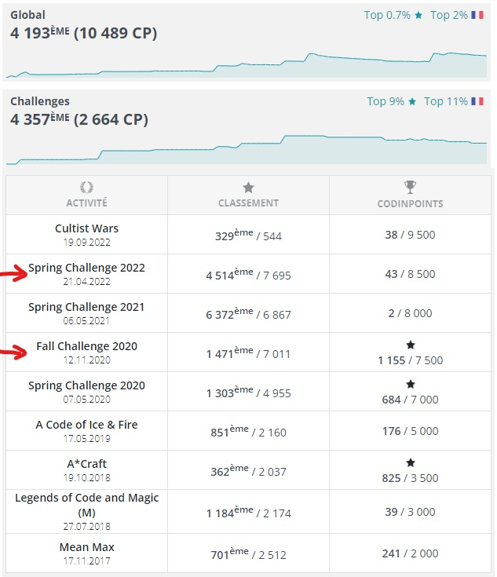
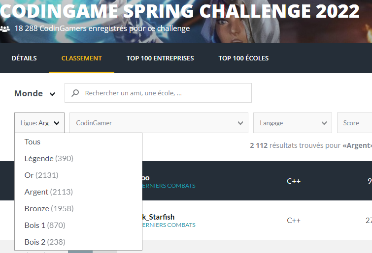
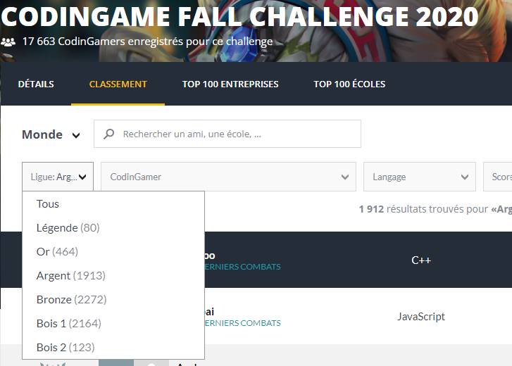

# What I have done
Code examples done in codingame challenge.

In codingame challenge, only one file is required. That why you will not find .h file.
The difficulty gradually increases as the variability of features is taken into account.
These are the raw files obtained at the end of the challenge, so they are not cleaned yet.

For both of the two challenges presented here, I finished in the **silver league** but the repartirion of the members over leagues are not the same.

## [Sprint challenge 2022](https://www.codingame.com/multiplayer/bot-programming/spring-challenge-2022)
score: 4514/7695 

## [Fall challenge 2020](https://www.codingame.com/multiplayer/bot-programming/fall-challenge-2020)
score: 1471/7011

